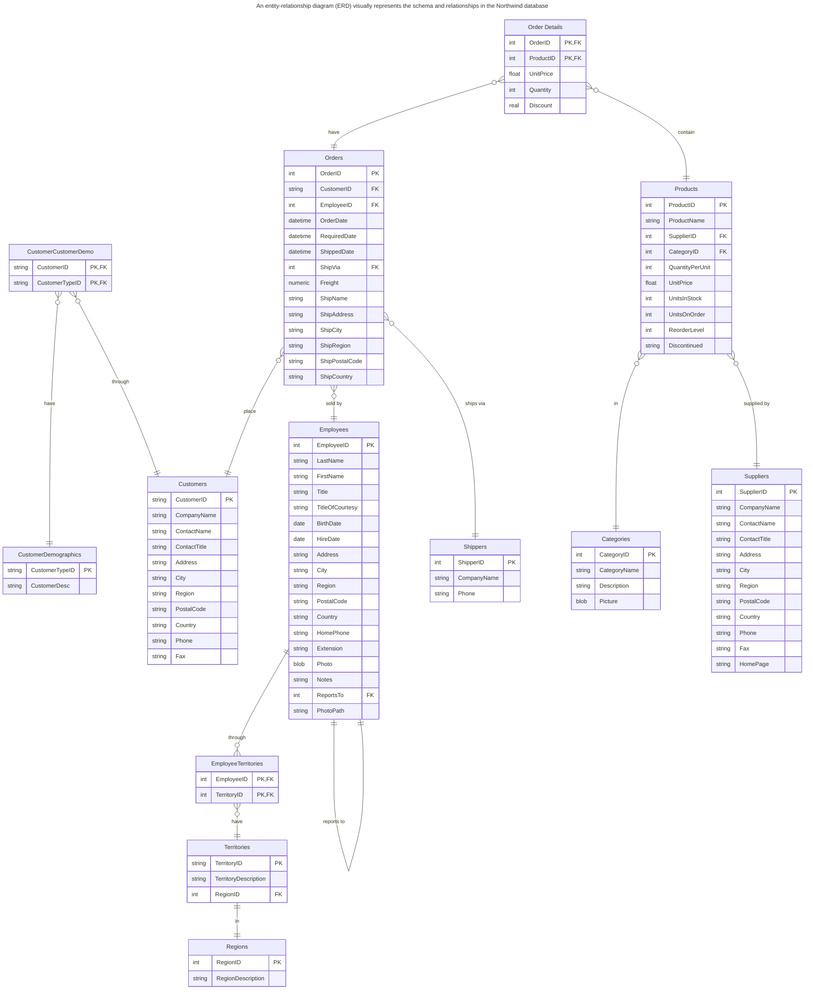

[TOC]

***

## Introduction to the Northwind Database

### Schema and Relationships

The Northwind database features a rich schema that models various aspects of a company's sales and distribution operations. Understanding the schema and relationships between tables is essential for effectively querying and analyzing the data. This section provides an overview of the schema and the key relationships within the Northwind database.

#### Schema Overview

The Northwind database schema is designed to represent a company's customers, orders, products, employees, and suppliers. It includes multiple tables, each with a specific role in the overall database structure. Here are the key tables and their primary relationships:

1. **Customers**:
    - **Description**: Stores information about the company's customers.
    - **Primary Key**: `CustomerID`
    - **Relationships**: Linked to the `Orders` table via the `CustomerID` field.

2. **Orders**:
    - **Description**: Contains details about customer orders.
    - **Primary Key**: `OrderID`
    - **Foreign Keys**:
        - `CustomerID` references `Customers.CustomerID`
        - `EmployeeID` references `Employees.EmployeeID`
        - `ShipVia` references `Shippers.ShipperID`
    - **Relationships**: Linked to the `Order Details`, `Customers`, `Employees`, and `Shippers` tables.

3. **Order Details**:
    - **Description**: Stores detailed information about each product in an order.
    - **Primary Key**: Composite key (`OrderID`, `ProductID`)
    - **Foreign Keys**:
        - `OrderID` references `Orders.OrderID`
        - `ProductID` references `Products.ProductID`
    - **Relationships**: Linked to the `Orders` and `Products` tables.

4. **Products**:
    - **Description**: Lists all products available for sale.
    - **Primary Key**: `ProductID`
    - **Foreign Keys**:
        - `SupplierID` references `Suppliers.SupplierID`
        - `CategoryID` references `Categories.CategoryID`
    - **Relationships**: Linked to the `Order Details`, `Suppliers`, and `Categories` tables.

5. **Suppliers**:
    - **Description**: Contains information about product suppliers.
    - **Primary Key**: `SupplierID`
    - **Relationships**: Linked to the `Products` table via the `SupplierID` field.

6. **Employees**:
    - **Description**: Stores details about company employees.
    - **Primary Key**: `EmployeeID`
    - **Relationships**: Linked to the `Orders` table via the `EmployeeID` field.

7. **Categories**:
    - **Description**: Categorizes products available in the database.
    - **Primary Key**: `CategoryID`
    - **Relationships**: Linked to the `Products` table via the `CategoryID` field.

8. **Shippers**:
    - **Description**: Lists the shipping companies used to ship orders.
    - **Primary Key**: `ShipperID`
    - **Relationships**: Linked to the `Orders` table via the `ShipperID` field.

9. **Territories**:
    - **Description**: Contains information about sales territories.
    - **Primary Key**: `TerritoryID`
    - **Foreign Keys**:
        - `RegionID` references `Region.RegionID`
    - **Relationships**: Linked to the `Region` table via the `RegionID` field.

10. **Region**:
    - **Description**: Lists the regions where the company operates.
    - **Primary Key**: `RegionID`
    - **Relationships**: Linked to the `Territories` table via the `RegionID` field.

#### Key Relationships

The relationships between tables in the Northwind database are defined through foreign keys, which ensure referential integrity and enable complex queries involving multiple tables. Here are some of the key relationships:

1. **Customers and Orders**:
    - Each customer can place multiple orders.
    - The `CustomerID` in the `Orders` table references the `CustomerID` in the `Customers` table.

2. **Orders and Order Details**:
    - Each order can include multiple products.
    - The `OrderID` in the `Order Details` table references the `OrderID` in the `Orders` table.

3. **Orders and Employees**:
    - Each order is processed by an employee.
    - The `EmployeeID` in the `Orders` table references the `EmployeeID` in the `Employees` table.

4. **Orders and Shippers**:
    - Each order is shipped via a shipping company.
    - The `ShipVia` in the `Orders` table references the `ShipperID` in the `Shippers` table.

5. **Order Details and Products**:
    - Each order detail references a specific product.
    - The `ProductID` in the `Order Details` table references the `ProductID` in the `Products` table.

6. **Products and Suppliers**:
    - Each product is supplied by a supplier.
    - The `SupplierID` in the `Products` table references the `SupplierID` in the `Suppliers` table.

7. **Products and Categories**:
    - Each product belongs to a category.
    - The `CategoryID` in the `Products` table references the `CategoryID` in the `Categories` table.

8. **Territories and Region**:
    - Each territory belongs to a region.
    - The `RegionID` in the `Territories` table references the `RegionID` in the `Region` table.

#### Entity-Relationship Diagram

An entity-relationship diagram (ERD) visually represents the schema and relationships in the Northwind database. Here is an example ERD to help you understand the structure:

_Adapted from https://github.com/jpwhite3/northwind-SQLite3_.

This ER diagram shows the relationships between the various entities in the Northwind database. The relationships indicate how data in one table is related to data in another table, which is essential for performing complex queries and maintaining data integrity.

#### Practical Applications

Understanding the schema and relationships in the Northwind database allows you to perform complex queries and analyses, such as:

  - Joining tables to retrieve comprehensive information about orders, including customer details, employee handling, and shipping information.

  - Aggregating sales data to analyze performance by product, category, supplier, or region.

  - Filtering data to find specific information, such as all orders shipped by a particular shipping company or products supplied by a specific supplier.

#### References and Additional Resources

To explore the schema and relationships in greater detail, consider the following resources:

  - [Northwind Database GitHub Repository](https://github.com/jpwhite3/northwind-SQLite3): Provides the SQLite version of the Northwind database along with detailed instructions for setup and usage.

  - [Official Microsoft Documentation](https://docs.microsoft.com/en-us/previous-versions/office/developer/office-2007/bb332055(v=office.12)): Offers Microsoft's official documentation for the Northwind database, including schema details and sample queries.

  - [SQL Tutorial](https://www.sqltutorial.org/sql-sample-database/): A tutorial that includes the Northwind database as a sample for learning SQL, with practical exercises and examples.

By understanding the schema and relationships within the Northwind database, you can effectively leverage SQL to extract insights and perform data analysis, making it an invaluable resource for learning and teaching SQL and database concepts.
