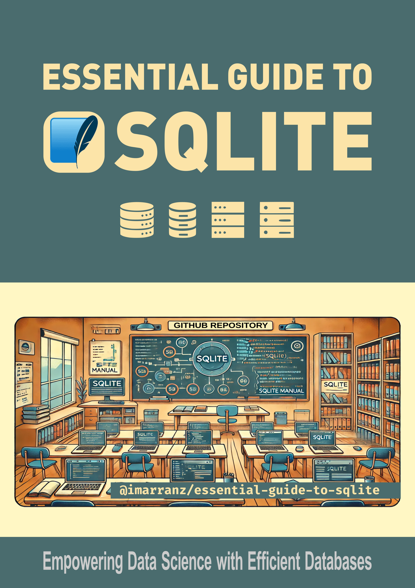

# Introduction

Welcome to my in-depth manual on SQLite, a powerful and lightweight relational database management system. SQLite is widely used in data science and machine learning applications due to its simplicity, efficiency, and portability. It provides a robust and easy-to-use platform for data storage, manipulation, and retrieval, making it an essential tool for data scientists and machine learning practitioners who need to manage and analyze large datasets efficiently. Whether you're building predictive models, conducting exploratory data analysis, or integrating data into machine learning workflows, SQLite offers the capabilities to support your data-driven projects.

    

        

            
        

        

            
<b>Essential Guide to SQLite</b>

            
Welcome to my guide on SQLite, a lightweight and effective relational database management system. It's prized in data science for its simplicity, efficiency, and portability. SQLite facilitates data storage, manipulation, and retrieval, making it crucial for data scientists handling large datasets and performing exploratory analysis or data integration in machine learning workflows.

            

            
            
            
            <a href="https://github.com/imarranz/essential-guide-to-sqlite">
                 
            
            
            

        

    

SQLite is a C-language library that implements a small, fast, self-contained, high-reliability, full-featured, SQL database engine. SQLite is the most used database engine in the world. It is embedded in many applications, from browsers to mobile phones, and is highly suitable for data analysis tasks.

In this manual, we will explore the multifaceted features of SQLite, covering a wide range of functionalities that cater to the needs of developers and data analysts. Our guide will walk you through the different key areas.

This manual is designed to empower you with the knowledge and skills to effectively manipulate and analyze data using SQLite, turning raw data into valuable insights. Let's begin our journey into the world of data management with SQLite.

SQLite, being a cornerstone in the realm of embedded databases, has a wealth of resources and references available for those looking to delve deeper into its capabilities.

## Contact Information

For any inquiries or further information about this project, please feel free to contact Ibon Martínez-Arranz. Below you can find his contact details and social media profiles.

    

        

            
        

        

            
I'm Ibon Martínez-Arranz, with a BSc in Mathematics and MScs in Applied Statistics and Mathematical Modeling. Since 2010, I've been with <a href="https://owlmetabolomics.com/">OWL Metabolomics</a>, initially as a researcher and now Head of the Data Science Department, focusing on Machine Learning Prediction, Statistical Computations, and supporting R&D projects.

            
            
            
            
        

    

<!--
3. **SQLite Community and Support:**

    - **Stack Overflow:** A large number of questions and answers can be found under the 'sqlite' tag on Stack Overflow. It's a great place to seek help and contribute to community discussions
-->
